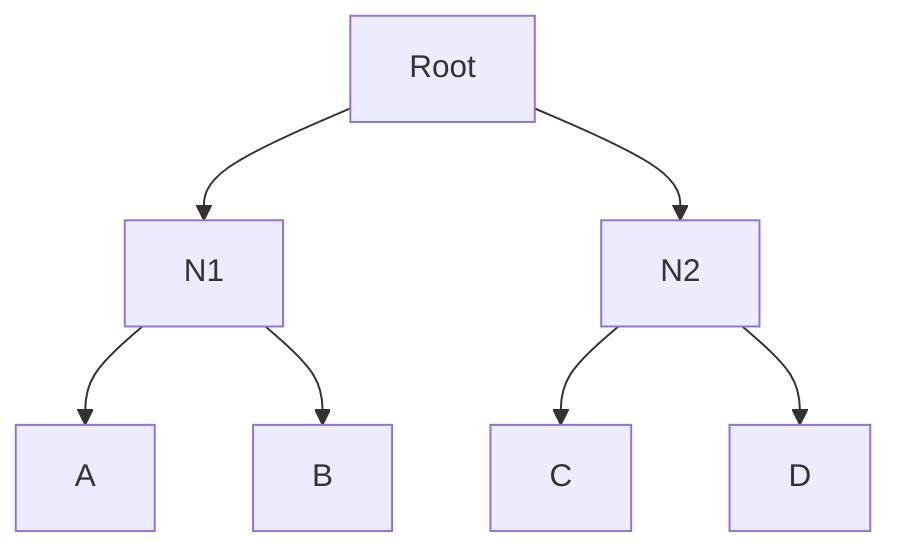
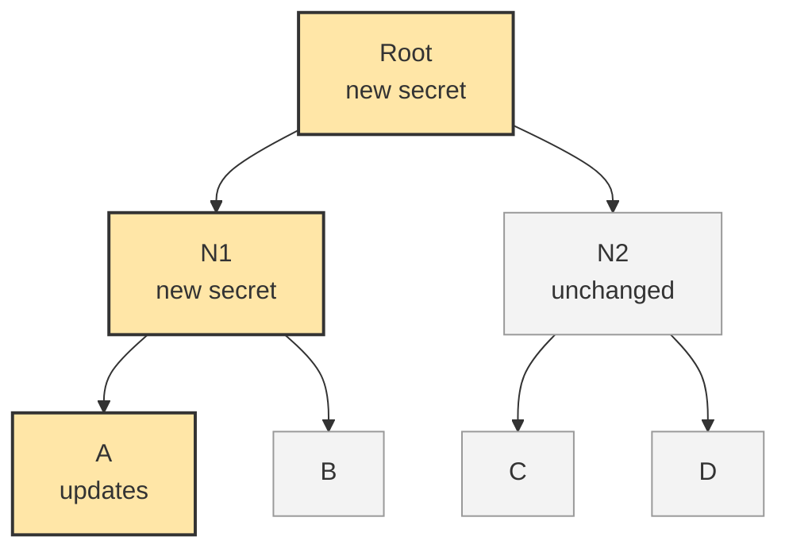
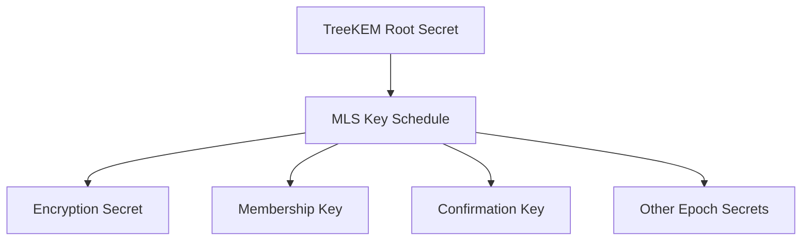

# MLS

This section introduces Messaging Layer Security (MLS), the standardised protocol used to provide secure group communication. Firstly, an overview and motivation for MLS are discussed. Next, the TreeKEM group key agreement protocol is presented, followed by the MLS key schedule and message structure. These mechanisms form the foundation of the implementation developed in this project. This section is based primarily on the MLS specification defined in RFC 9420 [Reference here]. Any material drawn from other sources is explicitly identified where relevant.

## Overview of MLS

MLS was developed to provide secure group communication with end-to-end encryption, efficient group membership management and asynchronous operation. It was standardised by the IETF in 2023 through the publication of RFC 9420.

Although several secure group messaging systems existed prior to MLS, they relied on application-specific protocols and there was no widely adopted interoperable standard for end-to-end encrypted group communication that combined scalability, asynchronous operation and strong security guarantees. Traditional approaches, such as Signal’s pairwise-based group messaging architecture, perform well for small groups but become increasingly inefficient as group size grows and membership changes become more frequent. Moreover, in space communication networks, intermittent connectivity and long communication delays make asynchronous operation a fundamental requirement. A protocol that requires all participants to remain continuously connected becomes increasingly difficult to operate under these conditions.

MLS addresses these challenges by defining a common interoperable protocol for secure group communication. In addition to supporting efficient group membership management, MLS provides important security properties including Forward Secrecy and Post-Compromise Security. Together, these properties make MLS particularly suitable for dynamic and intermittently connected environments.

At a high level, MLS consists of three main components. The first is the group state, which maintains information about group membership and cryptographic state. The second is TreeKEM, a continuous group key agreement protocol responsible for managing and updating group secrets. The third is the MLS message protection mechanism, which uses cryptographic material derived from the MLS Key Schedule to authenticate and encrypt messages exchanged between group members. The following sections focus on the components most relevant to this project.

## TreeKEM and the Ratchet Tree

A central component of MLS is TreeKEM, a continuous group key agreement protocol that efficiently manages cryptographic secrets within a group. TreeKEM uses a binary tree structure, known as a ratchet tree, to manage and update group key material without requiring pairwise key updates between all participants. The term "ratchet" refers to a one-way key update process in which each new secret replaces the previous one, preventing earlier secrets from being derived from later values. This feature of MLS will be discussed at a later section.

The following figure presents a simplified ratchet tree used for illustration. Actual MLS implementations maintain additional cryptographic state at each node and may contain substantially larger numbers of participants. In this example, participants A, B, C and D occupy the leaf nodes at the bottom of the tree. The intermediate nodes, N1 and N2, contain cryptographic secrets associated with subsets of group members. At the top of the tree, the root node represents the cryptographic state shared by the group. The secret associated with this node serves as the starting point for deriving the encryption keys used to protect group communications.

Figure: Example ratchet tree structure used by TreeKEM.

The hierarchical structure of the ratchet tree allows group secrets to be updated efficiently. Rather than requiring every participant to establish new pairwise keys with every other participant, TreeKEM only updates the secrets along a member’s direct path to the root of the tree. This reduces the communication and computational cost of key updates from scaling with the number of group members to scaling with the height of the tree, resulting in O(log n) communication and computation complexity.

When a participant wishes to refresh the group’s cryptographic state, MLS performs an **Update** operation. Updates may be performed periodically to refresh group secrets or following a suspected compromise in order to maintain Forward Secrecy and Post-Compromise Security. The updating member generates a fresh path secret and derives new secrets for each node on its direct path to the root. The previous secrets stored at these nodes are replaced by the newly derived values.

The update is distributed to the remainder of the group through a **Commit** message. After receiving a Commit message, each group member updates their local copy of the ratchet tree and derives the new secrets needed to communicate securely with the group. Once the Commit has been successfully processed, the group advances to a new epoch. Each epoch represents a distinct cryptographic state from which new encryption keys are derived. This process is illustrated in the following figure.

Figure: Simplified TreeKEM Update operation. When member A performs an Update operation, only the secrets on A’s direct path to the root are replaced. Other group members process the resulting Commit message to derive the updated tree state and enter a new epoch.

While TreeKEM is responsible for maintaining and updating the group’s cryptographic state, the resulting root secret is only the starting point. The following section explains how MLS derives successive epoch secrets and message encryption keys through the MLS Key Schedule.

## MLS Key Schedule

The root secret produced by TreeKEM is used as input to the MLS Key Schedule, which derives the cryptographic secrets and encryption keys required by the rest of the protocol. Whenever the group enters a new epoch, the key schedule generates a fresh set of secrets for different protocol functions. This separation helps ensure that the compromise of one key does not affect all other cryptographic operations.

At a high level, the key schedule transforms the root secret produced by TreeKEM into a set of epoch secrets used for different purposes. These include secrets used for application message encryption, membership authentication and confirmation of group state consistency. By deriving separate secrets for separate functions, MLS maintains cryptographic separation between protocol components while ensuring that all group members share a consistent cryptographic state.

The key schedule organises the lifetime of an MLS group into discrete periods called epochs. A new epoch is created whenever a Commit operation changes the cryptographic state of the group, such as when a member is added, removed or updates its key material. Each epoch has its own distinct set of cryptographic secrets and encryption keys. Therefore, as the group evolves, the keys used to protect communication are refreshed as well.

The key schedule is based on HKDF, a key derivation function introduced in Section X.X. For the purposes of this project, the most important point is that the TreeKEM root secret is not used directly. Instead, it is used as input to the MLS Key Schedule, which expands it into the secrets needed by the rest of the protocol. In practice, the MLS Key Schedule combines the TreeKEM-derived secret with additional inputs defined by the protocol, but these details are omitted here for clarity.

Figure X: Derivation of MLS epoch secrets from the TreeKEM root secret.

The encryption secret is used to derive the encryption keys that protect application messages exchanged between group members. The membership key contributes to the authentication of certain MLS protocol messages and helps verify group membership. The confirmation key is used to confirm that all group members have reached the same epoch after processing a Commit. While the MLS Key Schedule determines which cryptographic secrets are available within a given epoch, these secrets only become useful when applied to actual protocol messages. The following section examines how MLS structures, authenticates and encrypts messages exchanged between group members.

## MLS Message Structure

Application messages, proposals and commits are represented internally as MLS content objects. Before transmission, these contents are authenticated and encapsulated within either a `PublicMessage` or `PrivateMessage` structure. 

`PublicMessage` provides authentication and integrity protection but does not encrypt the message contents. It is primarily used for certain protocol messages such as proposals and commits. `PrivateMessage` extends this protection by encrypting message contents and sender information, providing confidentiality in addition to authenticity and integrity. Application messages are always transmitted as `PrivateMessage` objects, while proposals and commits may be transmitted as either `PublicMessage` or `PrivateMessage` objects depending on the deployment requirements. Since application data is always transmitted using `PrivateMessage`, the structure of `PrivateMessage` is examined in more detail below.

Before transmission, MLS encapsulates message content within an `AuthenticatedContent` object, which binds the content to the authentication information required for integrity and sender verification. This authenticated content may be transmitted directly in a `PublicMessage` or encrypted and carried within a `PrivateMessage`. When encrypted, recipients can verify both the authenticity and integrity of the message after decryption.

The `PrivateMessage` structure is detailed as below:

| PrivateMessage field    | Encrypted? | Purpose |
| ----------------------- | ---------- | ------------------------- |
| `group_id`              | No         | Ensure the message belongs to the intended group. |
| `epoch`                 | No         | Ensure the message belongs to the current epoch. |
| `content_type`          | No         | Specify the content type: `application`, `proposal`, `commit`. |
| `authenticated_data`    | No         | Application-supplied metadata, covered by MLS authentication mechanisms but not encrypted. Similar to AEAD's Additional Authenticated Data (AAD). |
| `encrypted_sender_data` | Yes        | Contains encrypted sender information, allowing only group members to determine which member sent the message. |
| `ciphertext`            | Yes        | The main AEAD ciphertext payload. Contains the encrypted `AuthenticatedContent` object, including the message content, authentication information and optional padding. |

Table X: Structure of MLS's `PrivateMessage`.

A notable feature of MLS is the separate encryption of sender information through the `encrypted_sender_data` field. This prevents external observers from determining which group member transmitted a particular message, providing additional metadata protection beyond message confidentiality.

The message structures described above define how MLS data is authenticated and protected during transmission. However, the cryptographic state represented by a given epoch changes over time as members join, leave or refresh their key material. The following section examines the MLS operations that trigger these changes and cause the group to advance to new epochs.

## MLS Operations Relevant to This Project

MLS defines a number of protocol operations used to manage group membership and maintain the cryptographic state of the group. These operations are communicated through MLS proposals and commits, which collectively allow members to add participants, remove participants and update cryptographic material. Since the implementation developed in this project focuses on maintaining secure communication in space environments, the operations most relevant to this work are Add, Remove, Update and Commit.

For the purposes of this project, MLS operations are treated as events that modify the cryptographic state of the group. Whenever a Commit is processed, a new epoch is created and fresh message protection keys become available. The implementation developed in this work relies on these MLS mechanisms while focusing on how the resulting secure communications can be transported efficiently across delayed and intermittently connected space networks.

### Add Operation

The Add operation introduces a new participant into an MLS group. An existing group member creates an Add proposal containing the credentials of the new participant. The proposal is subsequently incorporated into a Commit message, causing the group to advance to a new epoch. The new participant receives a Welcome message containing the information required to construct the current group state and derive the necessary cryptographic secrets.

### Remove Operation

The Remove operation excludes a participant from the group. Once the removal has been committed, the group’s cryptographic state is refreshed and a new epoch is created. Because the removed participant no longer possesses the secrets required to derive future epoch keys, they lose access to subsequent group communications.

### Update Operation

The Update operation refreshes a member’s cryptographic contribution to the group without changing membership. The updating member generates a fresh path secret and distributes the corresponding public key material through a Commit message. All remaining members derive the resulting tree state and transition to a new epoch. Update operations play an important role in maintaining Forward Secrecy and Post-Compromise Security.

### Commit Operation

As described in the previous TreeKEM and Key Schedule sections, Commit messages are responsible for applying proposed changes to the group state. A Commit may contain one or more Add, Remove or Update proposals and represents the mechanism through which these changes become effective. Processing a Commit causes group members to update their ratchet trees, derive fresh epoch secrets and advance to a new epoch.

MLS provides the cryptographic framework required for secure group communication, including group key management, message protection and membership operations. However, these mechanisms address only the security layer of the system, as the MLS protocol assumes the existence of an underlying transport capable of delivering messages between participants. Given that this project employs QUIC as that transport layer, the following section examines the design of QUIC and the transport characteristics most relevant to communication in space environments.
