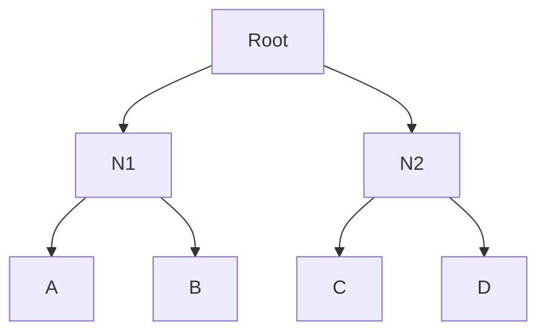
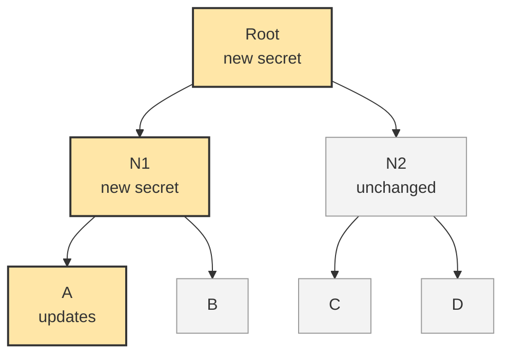

# MLS

This section introduces Messaging Layer Security (MLS), the standardised protocol used to provide secure group communication. Firstly, an overview and motivation for MLS are discussed. Next, the TreeKEM group key agreement protocol is presented, followed by the MLS key derivation process and record layer. These mechanisms form the foundation of the implementation developed in this project.

## Overview of MLS

MLS was developed to provide secure group communication with end-to-end encryption, efficient group membership management and asynchronous operation. It was standardised by the IETF in 2023 through the publication of RFC 9420.

Although several secure group messaging systems existed prior to MLS, they relied on application-specific protocols and there was no widely adopted interoperable standard for end-to-end encrypted group communication that combined scalability, asynchronous operation and strong security guarantees. Traditional approaches, such as Signal’s pairwise-based group messaging architecture, perform well for small groups but become increasingly inefficient as group size grows and membership changes become more frequent. Moreover, in space communication networks, intermittent connectivity and long communication delays make asynchronous operation a fundamental requirement. A protocol that requires all participants to remain continuously connected becomes increasingly difficult to operate under these conditions.

MLS addresses these challenges by defining a common interoperable protocol for secure group communication. In addition to supporting efficient group membership management, MLS provides important security properties including Forward Secrecy and Post-Compromise Security. Together, these properties make MLS particularly suitable for dynamic and intermittently connected environments.

At a high level, MLS consists of three main components. The first is the group state, which maintains information about group membership and cryptographic state. The second is TreeKEM, a continuous group key agreement protocol responsible for managing and updating group secrets. The third is the MLS record layer, which uses the secrets generated by TreeKEM to protect application messages. The following sections focus on the components most relevant to this project.

## TreeKEM and the Ratchet Tree

A central component of MLS is TreeKEM, a continuous group key agreement protocol that efficiently manages cryptographic secrets within a group. TreeKEM uses a binary tree structure, known as a ratchet tree, to manage and update group key material without requiring pairwise key updates between all participants.

The following figure presents a simplified ratchet tree used for illustration. Actual MLS implementations maintain additional cryptographic state at each node and may contain substantially larger numbers of participants.

In this example, participants A, B, C and D occupy the leaf nodes at the bottom of the tree. The intermediate nodes, N1 and N2, contain cryptographic secrets associated with subsets of group members. At the top of the tree, the root node contains the group secret from which the encryption keys used to protect group messages are ultimately derived.

Figure: Example ratchet tree structure used by TreeKEM.

The hierarchical structure of the ratchet tree allows group secrets to be updated efficiently. Rather than requiring every participant to establish new pairwise keys with every other participant, TreeKEM only updates the secrets along a member’s direct path to the root of the tree. This reduces the communication and computational cost of key updates from scaling with the number of group members to scaling with the height of the tree, resulting in O(log n) communication and computation complexity.

When a participant wishes to refresh the group’s cryptographic state, MLS performs an **Update** operation. Updates may be performed periodically to refresh group secrets or following a suspected compromise in order to maintain Forward Secrecy and Post-Compromise Security. The updating member generates a fresh path secret and derives new secrets for each node on its direct path to the root. The previous secrets stored at these nodes are replaced by the newly derived values.

The update is distributed to the remainder of the group through a **Commit** message. After receiving a Commit message, each group member updates their local copy of the ratchet tree and derives the new secrets needed to communicate securely with the group. Once the Commit has been successfully processed, the group advances to a new epoch. Each epoch represents a distinct cryptographic state from which new encryption keys are derived. This process is illustrated in the following figure.

Figure: Simplified TreeKEM Update operation. When member A performs an Update operation, only the secrets on A’s direct path to the root are replaced. Other group members process the resulting Commit message to derive the updated tree state and enter a new epoch.

## MLS Key Schedule

TreeKEM is responsible for maintaining and updating the cryptographic state of the group. However, the secrets stored within the ratchet tree are not used directly for message encryption, to ensure cryptographic separation (If one derived key is exposed or misused, it does not automatically compromise every other function of the protocol). Instead, MLS employs a key schedule that derives a collection of cryptographic secrets and encryption keys from the TreeKEM output whenever the group enters a new epoch.

At a high level, the key schedule transforms the root secret produced by TreeKEM into a set of specialised secrets that serve different purposes within the protocol. These include secrets used for application message encryption, membership authentication and confirmation of group state consistency. By deriving separate keys for different functions, MLS achieves cryptographic separation between protocol components while ensuring that all group members maintain a consistent cryptographic state.

## MLS Record Layer

TODO:

* MLSCiphertext
* Header
* Encrypted content
* Authentication tag
* What is encrypted and what remains visible

## MLS Operations Relevant to this Project
